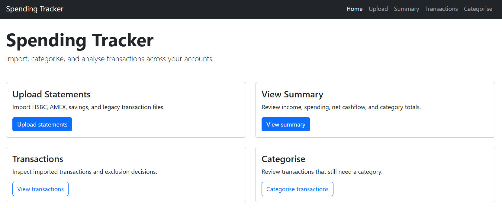
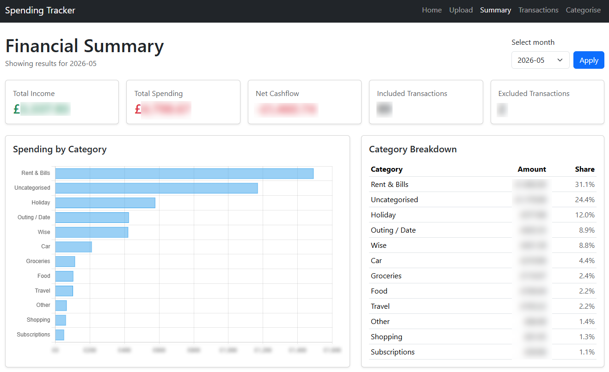
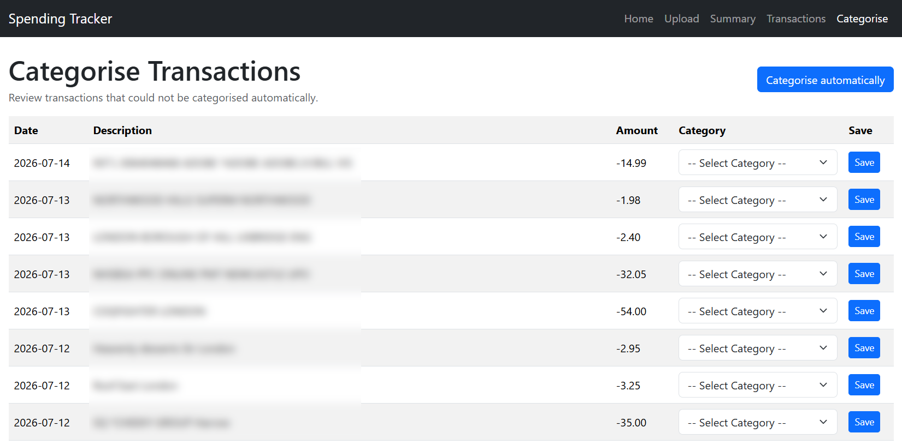

# Personal Finance Tracker

A Flask web application for importing, categorising and analysing personal spending from multiple bank statements.

The application combines transactions from different accounts into a single database, automatically categorises common merchants, removes duplicate imports and provides an interactive spending dashboard.

## Features

- Import transactions from multiple statement formats:
  - HSBC Current Account
  - HSBC Credit Card
  - AMEX
  - Legacy Excel spreadsheets
- Automatic transaction categorisation using configurable keyword rules
- Manual categorisation for uncategorised transactions
- Duplicate detection using transaction fingerprints
- Exclude internal transfers and other transactions from summaries
- Monthly and overall financial summaries
- Spending breakdown by category
- Interactive Chart.js visualisations
- Automated folder import for monthly statements

## Highlights

- Supports four different statement formats
- Automatically removes duplicate imports
- Automatically categorises common merchants
- Combines transactions into a single searchable database
- Interactive monthly spending dashboard

## Screenshots

### Home



### Summary Dashboard



### Transaction Categorisation



## Technologies

- Python
- Flask
- SQLAlchemy
- SQLite
- Pandas
- Jinja2
- Bootstrap 5
- Chart.js

## Project Structure

```
personal-finance-tracker/
│
├── app/
│   ├── routes.py
│   ├── models.py
│   ├── services/
│   ├── templates/
│   └── static/
│
├── scripts/
│
├── data/
│
├── instance/
│
├── run.py
└── serve.py
```

## Getting Started

Clone the repository:

```bash
git clone https://github.com/<your-username>/personal-finance-tracker.git
cd personal-finance-tracker
```

Create a virtual environment:

```bash
python -m venv venv
```

Activate it:

Windows

```bash
venv\Scripts\activate
```

Install dependencies:

```bash
pip install -r requirements.txt
```

Run the application:

```bash
python run.py
```

Then open:

```
http://127.0.0.1:5000
```

## How it Works

1. Download your bank statements.
2. Upload them through the application (or use the automated import script).
3. Transactions are normalised into a common format.
4. Duplicate transactions are ignored.
5. Transactions are automatically categorised where possible.
6. Remaining transactions can be categorised manually.
7. View spending summaries and visualisations.

## Future Improvements

- Support additional statement formats
- Improved categorisation rules
- Automatic bank integrations
- Additional dashboards and visualisations
- Budget tracking
- Recurring transaction detection

## License

This project is licensed under the MIT License.